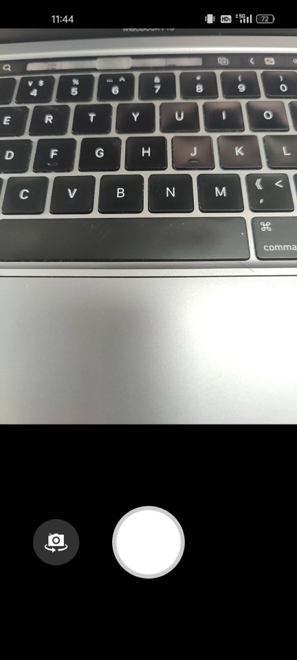

# AndroidCamera

本项目主要涉及Android开发中Camera的相关操作、预览方式、视频录制等。项目结构简单代码耦合性低，适合学习和使用

    

  

## lib-camera
|包|说明  |
|--|--|
| camera | camera相关操作功能包，包括Camera和Camera2。以及各种预览视图 |
| encoder | MediaCdoec录制视频相关，包括对ByteBuffer和Surface的录制 |
| gles | opengles操作相关 |
| permission | 权限相关 |
| util | 工具类 |

每个包都可独立使用，耦合度低，方便白嫖：）

## 预览视图

<table>
  <thead>
  	<th>类名</th>
    <th>功能说明</th>
	</thead>
  <tbody>
    <tr>
      <td>CameraSurfaceView</td>
      <td>1.SurfaceView+Camera 2.包含MediaCodec+Buffer录制视频</td>
    </tr>
    <tr>
      <td>CameraTextureView</td>
      <td>TextureView+Camera</td>
    </tr>
    <tr>
      <td>CameraGLSurfaceView</td>
      <td>1.GLSurfaceView+Camera 2.MediaCodec+Surface录制视频，<b>多线程共享EGL</b>方式</td>
    </tr>
    <tr>
      <td>CameraGLESSurfaceView</td>
      <td>1.SurfaceView+OpenGL ES+Camera 2.MediaCodec+Surface录制视频，三种渲染方式：<ul><li><b>Draw Twice</b></li><li><b>Draw FBO</b></li> <li><b>Draw Blit framebuffer</b></li></ul></td>
    </tr>
    <tr>
      <td>CameraGLTextureView</td>
      <td>1.TextureView+OpenGL ES+Camera 2.MediaCodec+Surface录制视频，三种渲染方式：<ul><li><b>Draw Twice</b></li><li><b>Draw FBO</b></li> <li><b>Draw Blit framebuffer</b></li></ul></td>
    </tr>
    <tr>
      <td>Camera2SurfaceView</td>
      <td>SurfaceView+Camera2</td>
    </tr>
    <tr>
      <td>Camera2TextureView</td>
      <td>TextureView+Camera2</td>
    </tr>
    <tr>
      <td>Camera2GLSurfaceView</td>
      <td>1.GLSurfaceView+Camera2 2.MediaCodec+Surface录制视频，多线程共享EGL方式</td>
    </tr>
    <tr>
      <td>Camera2GLESSurfaceView</td>
      <td>1.SurfaceView+OpenGL ES+Camera2 2.MediaCodec+Surface录制视频，三种渲染方式：<ul><li><b>Draw Twice</b></li><li><b>Draw FBO</b></li> <li><b>Draw Blit framebuffer</b></li></ul></td>
    </tr>
    <tr>
      <td>Camera2GLTextureView</td>
      <td>1.TextureView+OpenGL ES+Camera2 2.MediaCodec+Surface录制视频，三种渲染方式：<ul><li><b>Draw Twice</b></li><li><b>Draw FBO</b></li> <li><b>Draw Blit framebuffer</b></li></ul></td>
    </tr>
  </tbody>
</table>

## FAQ

### 1.如何切换预览尺寸

`ICameraManager`提供了`setPreviewSize(Size size)`接口可以在openCamera之前设置想要的预览尺寸

### 2.如何获取预览帧数据

`ICameraManager`提供了`addPreviewBufferCallback(PreviewBufferCallback previewBufferCallback)`接口可以在回调中获取Camera预览数据，格式为**NV21**

> 注意：获取的byte[]是可复用的，需要您自行arrayCopy一份使用

### 3.如何拍照

`ICameraManager`提供了`takePicture(PictureBufferCallback pictureCallback)`接口可以在回调中获取拍照数据，格式为**JPG**

## Blog

Camera系列

[Android Camera系列（一）：SurfaceView+Camera](https://blog.csdn.net/xiaozhiwz/article/details/141472537)

[Android Camera系列（二）：TextureView+Camera](https://blog.csdn.net/xiaozhiwz/article/details/141855031)

[Android Camera系列（三）：GLSurfaceView+Camera](https://blog.csdn.net/xiaozhiwz/article/details/141860162)

[Android Camera系列（四）：TextureView+OpenGL ES+Camera](https://blog.csdn.net/xiaozhiwz/article/details/142781497)

[Android Camera系列（五）：Camera2](https://blog.csdn.net/xiaozhiwz/article/details/142555345)

[Android Camera系列（六）：MediaCodec视频编码上-编码YUV](https://blog.csdn.net/xiaozhiwz/article/details/143114530)

[Android Camera系列（七）：MediaCodec视频编码中-OpenGL ES多线程渲染](https://blog.csdn.net/xiaozhiwz/article/details/143144103)

[Android Camera系列（八）：MediaCodec视频编码下-OpenGL ES离屏渲染](https://blog.csdn.net/xiaozhiwz/article/details/144508534)

OpenGL ES系列

[Android OpenGLES开发：EGL环境搭建](https://blog.csdn.net/xiaozhiwz/article/details/141868444)

[Android OpenGLES2.0开发（一）：艰难的开始](https://blog.csdn.net/xiaozhiwz/article/details/142354149)

[Android OpenGLES2.0开发（二）：环境搭建](https://blog.csdn.net/xiaozhiwz/article/details/142366766)

[Android OpenGLES2.0开发（三）：绘制一个三角形](https://blog.csdn.net/xiaozhiwz/article/details/142453506)

[Android OpenGLES2.0开发（四）：矩阵变换和相机投影](https://blog.csdn.net/xiaozhiwz/article/details/142488394)

[Android OpenGLES2.0开发（五）：绘制正方形和圆形](https://blog.csdn.net/xiaozhiwz/article/details/142530158)

[Android OpenGLES2.0开发（六）：着色器语言GLSL](https://blog.csdn.net/xiaozhiwz/article/details/142790866)

[Android OpenGLES2.0开发（七）：纹理贴图之显示图片](https://blog.csdn.net/xiaozhiwz/article/details/142871148)

[Android OpenGLES2.0开发（八）：Camera预览](https://blog.csdn.net/xiaozhiwz/article/details/143239446)

[Android OpenGLES2.0开发（九）：图片滤镜](https://blog.csdn.net/xiaozhiwz/article/details/143847341)

[Android OpenGLES2.0开发（十）：FBO离屏渲染](https://blog.csdn.net/xiaozhiwz/article/details/144554451)

参考：

1. [https://github.com/afei-cn/CameraDemo](https://github.com/afei-cn/CameraDemo)
2. [https://github.com/saki4510t/UVCCamera](https://github.com/saki4510t/UVCCamera)
3. [https://github.com/google/grafika](https://github.com/google/grafika)