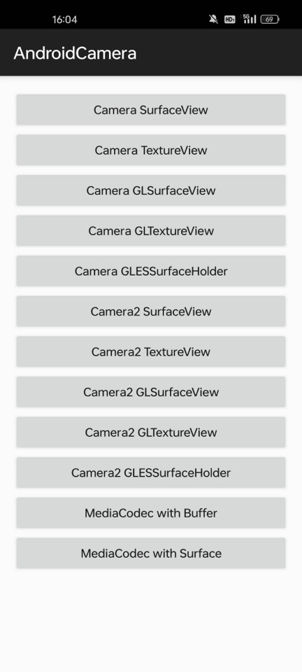

# AndroidCamera

本项目主要涉及Android开发中Camera的相关操作、预览方式、视频录制等。项目结构简单代码耦合性低，适合学习和使用

    

  

## lib-camera
|包|说明  |
|--|--|
| camera | camera相关操作功能包，包括Camera和Camera2。以及各种预览视图 |
| encoder | MediaCdoec录制视频相关，包括对ByteBuffer和Surface的录制 |
| gles | opengles操作相关 |
| permission | 权限相关 |
| util | 工具类 |

每个包都可独立使用，耦合度低，方便白嫖：）

## FAQ

### 1.如何切换预览尺寸

`ICameraManager`提供了`setPreviewSize(Size size)`接口可以在openCamera之前设置想要的预览尺寸

### 2.如何获取预览帧数据

`ICameraManager`提供了`addPreviewBufferCallback(PreviewBufferCallback previewBufferCallback)`接口可以在回调中获取Camera预览数据，格式为**NV21**

> 注意：获取的byte[]是可复用的，需要您自行arrayCopy一份使用

### 3.如何拍照

`ICameraManager`提供了`takePicture(PictureBufferCallback pictureCallback)`接口可以在回调中获取拍照数据，格式为**JPG**

## Blog

[Android Camera系列（一）：SurfaceView+Camera](https://blog.csdn.net/xiaozhiwz/article/details/141472537)

[Android Camera系列（二）：TextureView+Camera](https://blog.csdn.net/xiaozhiwz/article/details/141855031)

参考：
1. [https://github.com/afei-cn/CameraDemo](https://github.com/afei-cn/CameraDemo)
2. [https://github.com/saki4510t/UVCCamera](https://github.com/saki4510t/UVCCamera)
3. [https://github.com/google/grafika](https://github.com/google/grafika)